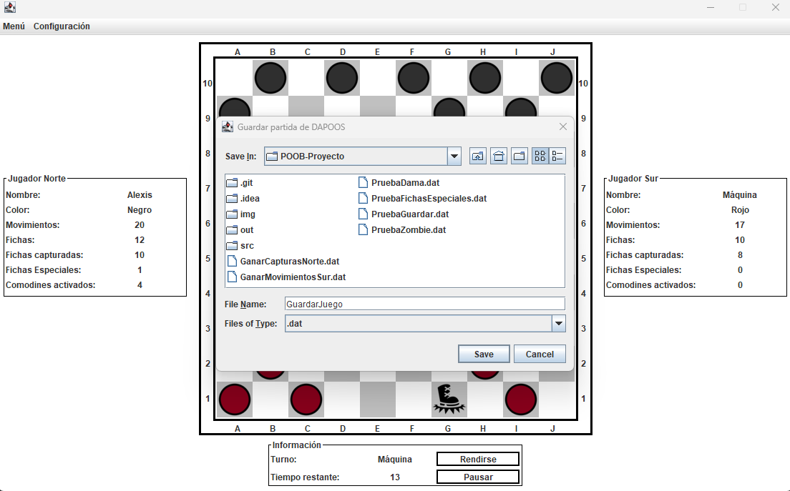
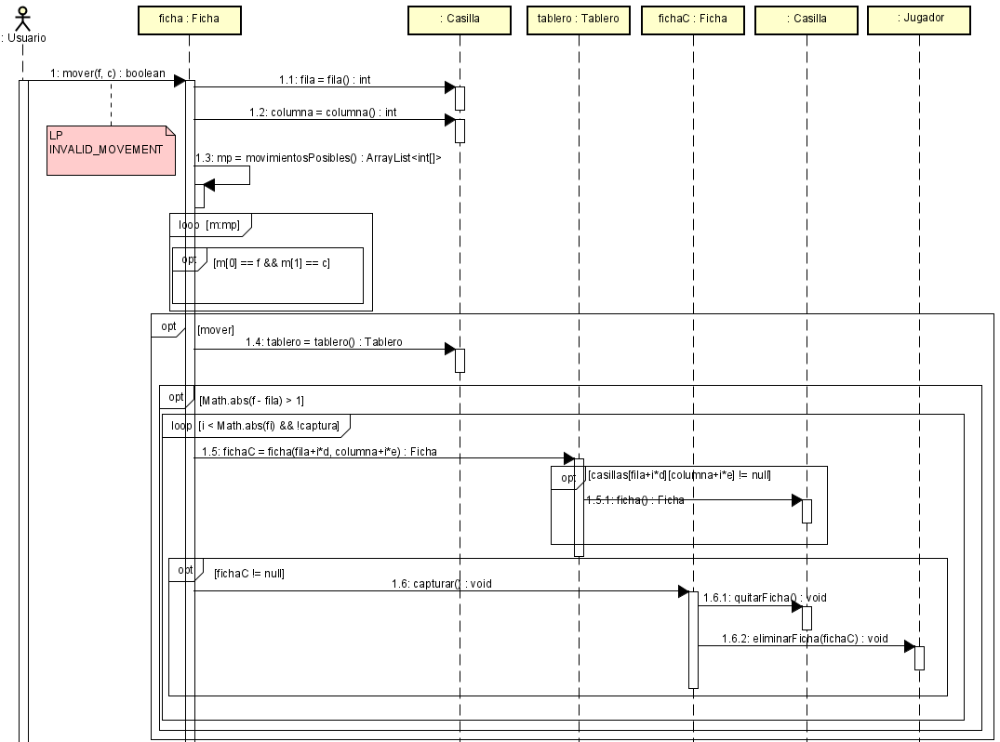

# daPOOs

daPOOs es un juego de damas desarrollado para el curso de Programación Orientada a Objetos (POOB) en la Escuela Colombiana de Ingeníería Julio Garavito. Es una versión modernizada del juego clásico de damas que incluye nuevas características y funcionalidades.


## Información General

El proyecto daPOOs consistió en modelar un juego de damas con características adicionales utilizando programación orientada a objetos en Java. Se implementó una arquitectura de 2 capas (presentación y dominio) para separar la lógica del juego de la interfaz gráfica.

## Los principales objetivos del proyecto fueron:

* Aplicar conceptos de POO como clases, objetos, herencia, polimorfismo, etc.
* Desarrollar un modelo sólido mediante un buen diseño orientado a objetos.
* Implementar patrones como MVC para desacoplar components.
* Crear una interfaz gráfica intuitiva con Swing.
* Permitir guardar/cargar partidas serializando objetos.
* Tener un código bien documentado y probado.

## Características Principales

Las características principales que se agregaron al juego de damas clásico son:

* **Jugador máquina:** Permite jugar contra una máquina con distintos niveles.
* **Límite de tiempo por turno:** Agrega la opción de un modo quicktime.

   

* **Fichas especiales:** Las fichas pueden evolucionar a nuevos tipos (ninja, zombie, etc).

  

* **Casillas especiales:** Se agregan casillas con comportamientos únicos.

  

* **Comodines:** Otorgan poderes especiales de manera aleatoria.

  

* **Guardado/Carga:** Permite serializar el estado y persistir partidas.

  

## Arquitectura

El proyecto tiene una arquitectura de 2 capas:

* **Capa de presentación:** Contiene la interfaz gráfica desarrollada con Swing (JFrame, JPanel, JButton, etc). Maneja los eventos y muestra el estado del juego.
* **Capa de dominio:** Contiene las clases del modelo del juego como Tablero, Ficha, Jugador, etc. Define la lógica y reglas del juego.

## Diagramas

El proyecto cuenta con diagramas UML (daPOOS.asta) como:

* **Diagrama de clases:** Muestra la estructura del modelo. A continuación se muestra parte del diagrama de clases de la capa de dominio.

  

* **Diagramas de secuencia:** Detallan interacciones y flujos. El siguiente es uno de los de diagrama de secuencia realizados, es el correspondiente al método de mover de Ficha.

  

## Tecnologías

Las principales tecnologías y herramientas utilizadas fueron:

* **Java:** Lenguaje de programación orientado a objetos.
* **Swing:** Librería GUI para interfaces.
* **JUnit:** Framework de testing unitario.
* **IDE Eclipse:** Entorno de desarrollo integrado.

## Ejecución del proyecto

1. Clona el repositorio:
    ```
    git clone https://github.com/AlexisGR117/POOB-Proyecto.git
    ```
2. Navega a la carpeta del proyecto:
    ```
    cd POOB-Proyecto
    ```
3. Construye el proyecto:
    ```
    javac -d bin -cp junit-4.13.2.jar src\domain\*.java src\presentation\*.java src\test\*.java
    ```
4.  Documenta el proyecto, la documentación quedará en la carpeta docs, abre el archivo index.html para verla:
    ```
    javadoc -d docs src\domain\*.java src\presentation\*.java
    ```
5. Ejecuta las pruebas:
    ```
    java -cp "junit-4.13.2.jar;hamcrest-core-1.3.jar;bin" org.junit.runner.JUnitCore test.DAPOOSTest
    ```

6. Ejecuta el proyecto:

    **Opción uno**
    
    Abre un IDE como IntelliJ o Eclipse y corre el archivo DAPOOSGUI.java

   **Opción dos**

    Ejecuta el siguiente comando, seguido a esto debes copiar a bin/presentation las carpetas Sonidos e Imagenes que estan dentro de src/presentation.
   
    ```
    java -cp bin presentation.DAPOOSGUI
    ```
   
## Conclusiones

El desarrollo de este proyecto permitió aplicar de manera práctica conceptos fundamentales de programación orientada a objetos y trabajar todas las etapas del ciclo de vida del software. Además, se obtuvieron conocimientos sobre patrones de diseño, arquitectura en capas, interfaces gráficas, control de versiones, pruebas unitarias, entre otros.

## Autor

* Jefer Alexis González Romero